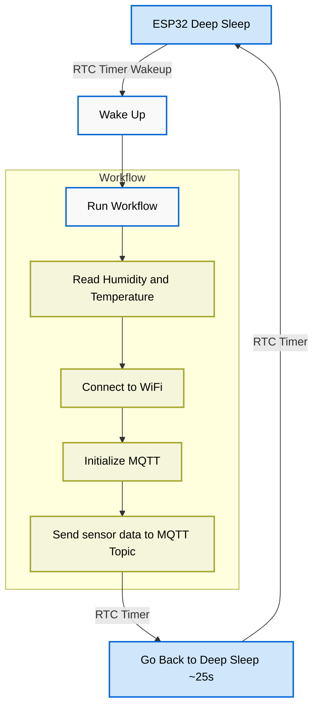

# Temperature and Humidity Sensor with ESP32

Welcome to the Liwaisi IoT! This project is a MQTT implementation with lower power consumption. We're using a DHT22 sensor to read temperature and humidity, connecting to a WiFi network and sending the data to a MQTT broker.

## Project Structure



## Prerequisites

- Espressif IDF [IoT Development Kit](https://docs.espressif.com/projects/esp-idf/en/stable/esp32/index.html) installed.
- ESP32 development board
- DHT22 sensor in the `GPIO_NUM_4`
- MQTT broker server

## Installation

Go to the root directory of the project and run the following commands:

#### Initialize ESP-IDF
```bash
. $IDF_PATH/export.sh
```
Note: Replace `$IDF_PATH` with the path to your ESP-IDF installation. If you're Windows user, use the following command from a powershell:
```powershell
$IDF_PATH/export.ps1
```

#### Configuring project values.

Run the following command to configure using the ESP-IDF `menuconfig`:
```bash
idf.py menuconfig
```
Navigate to the option `MQTT Project Configuration  --->` and configure the following values:

- MQTT Broker URL
- MQTT Broker Topic
- MQTT Broker Username
- MQTT Broker Password

The Username and Password can be optional if not configured.

Navigate to the option `WiFi Project Configuration  --->` and configure the following values:

- WiFi SSID
- WiFi Password

#### Build and Flash

Run the following command to build and flash the project:

```bash
idf.py build
```

Run the following command to flash the project:

```bash
idf.py flash -p <PORT>
```
Replace `<PORT>` with the port of your ESP32. Example: `/dev/ttyUSB0` or `COM3`.

### Monitor

Run the following command to monitor the output of the ESP32:

```bash
idf.py monitor
```

## License

This project is licensed under the GPL-3.0 license - see the [LICENSE](LICENSE) file for details.


